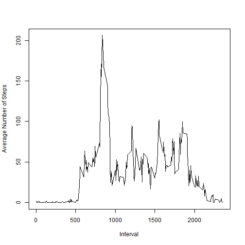

# Reproducible Research: Peer Assessment 1


## Loading and preprocessing the data

### Load the data -

1 We will be using data.table library for this assignment and use fread to load the data from file into a data table.


```r
require(data.table)
```

```
## Loading required package: data.table
```

2 Unzip the file in the local directory and read the file into the data table.


```r
fileName = "activity.zip"
##Unzip the file
unzip(fileName)
##Reading the file into data table
activity <- fread("./activity.csv")
```


### Process/transform the data (if necessary) into a format suitable for your analysis.

1 Eliminate the records with NA values in steps


```r
activityData <- activity[is.na(steps)==FALSE,]
```


## What is mean total number of steps taken per day?

1 - Make a histogram of the total number of steps taken each day


```r
sumData <- activityData[,sum(steps), by = date]
barplot(sumData$V1, names.arg = sumData$date, xlab = "Date", ylab = "Steps")
```

 


2 - Calculate and report the mean and median total number of steps taken per day


```r
sumData[,mean(V1)]
```

```
## [1] 10766
```

```r
sumData[,median(V1)]
```

```
## [1] 10765
```


## What is the average daily activity pattern?

1 - Make a time series plot (i.e. type = "l") of the 5-minute interval (x-axis) 
and the average number of steps taken, averaged across all days (y-axis)


```r
meanData <- activityData[,mean(steps), by = interval]
plot(meanData, type = "l", xlab = "Interval", ylab = "Average Number of Steps")
```

 

2 - Which 5-minute interval, on average across all the days in the dataset, 
contains the maximum number of steps?


```r
meanData$interval[which.max(meanData$V1)]
```

```
## [1] 835
```


## Imputing missing values

1 - Calculate and report the total number of missing values in the dataset (i.e. the total number of rows with NAs)


```r
activity[,ColNa := is.na(steps)]
```

```
##        steps       date interval ColNa
##     1:    NA 2012-10-01        0  TRUE
##     2:    NA 2012-10-01        5  TRUE
##     3:    NA 2012-10-01       10  TRUE
##     4:    NA 2012-10-01       15  TRUE
##     5:    NA 2012-10-01       20  TRUE
##    ---                                
## 17564:    NA 2012-11-30     2335  TRUE
## 17565:    NA 2012-11-30     2340  TRUE
## 17566:    NA 2012-11-30     2345  TRUE
## 17567:    NA 2012-11-30     2350  TRUE
## 17568:    NA 2012-11-30     2355  TRUE
```

```r
activity[,sum(ColNa)]
```

```
## [1] 2304
```

2 - Devise a strategy for filling in all of the missing values in the dataset. The strategy does not need to be sophisticated. For example, you could use the mean/median for that day, or the mean for that 5-minute interval, etc.

We will use the mean for the 5 Minute Interval in this case because certain days
have no valid values. In that case the mean and median will also return a missing value.


```r
setnames(meanData, c("interval","V1"), c("interval","steps"))
setkey(meanData, "steps")
setkey(activity, "steps")
updatedActivity <- merge(activity, meanData, by = "interval", suffixes = c(".x",
                                                                           ".y"))
rowsNa <- is.na(updatedActivity$steps.x)
updatedActivity$steps.x[rowsNa] <- updatedActivity$steps.y[rowsNa]
```

3 - Create a new dataset that is equal to the original dataset but with the missing data filled in.


4 - Make a histogram of the total number of steps taken each day and Calculate and report the mean and median total number of steps taken per day. Do these values differ from the estimates from the first part of the assignment? What is the impact of imputing missing data on the estimates of the total daily number of steps?


```r
sumUpdData <- updatedActivity[,sum(steps.x), by = date] 
barplot(sumUpdData$V1, names.arg = sumUpdData$date)
```

 

```r
sumUpdData[,mean(V1)]
```

```
## [1] 10766
```

```r
sumUpdData[,median(V1)]
```

```
## [1] 10766
```


## Are there differences in activity patterns between weekdays and weekends?

For this part the weekdays() function may be of some help here. Use the dataset with the filled-in missing values for this part.


1 - Create a new factor variable in the dataset with two levels ??? ???weekday??? and ???weekend??? indicating whether a given date is a weekday or weekend day.


```r
getWeekEnd <- function(wDay) {
        if (wDay %in% c("Saturday", "Sunday")) {
                "WeekEnd"
        } else {
                "WeekDay"
        }
}
updatedActivity[,wDay := weekdays(as.Date(date))]
```

```
##        interval steps.x       date ColNa steps.y      wDay
##     1:        0   1.717 2012-10-01  TRUE   1.717    Monday
##     2:        0   1.717 2012-10-08  TRUE   1.717    Monday
##     3:        0   1.717 2012-11-01  TRUE   1.717  Thursday
##     4:        0   1.717 2012-11-04  TRUE   1.717    Sunday
##     5:        0   1.717 2012-11-09  TRUE   1.717    Friday
##    ---                                                    
## 17564:     2355   0.000 2012-11-28 FALSE   1.075 Wednesday
## 17565:     2355   0.000 2012-11-29 FALSE   1.075  Thursday
## 17566:     2355   8.000 2012-10-19 FALSE   1.075    Friday
## 17567:     2355  20.000 2012-10-09 FALSE   1.075   Tuesday
## 17568:     2355  29.000 2012-10-17 FALSE   1.075 Wednesday
```

```r
updatedActivity$dayType <- sapply(updatedActivity$wDay, getWeekEnd)
```


2 - Make a panel plot containing a time series plot (i.e. type = "l") of the 5-minute interval (x-axis) and the average number of steps taken, averaged across all weekday days or weekend days (y-axis). 


```r
par(mfrow = c(2, 1), mar = c(4,4,2,1))
for (i in c("WeekDay","WeekEnd")) {
        subsetData <- updatedActivity[dayType == i,]
        dayTypeData <- subsetData[,mean(steps.x), by = interval]
        plot(dayTypeData, type = "l", main = "WeekDay", ylab = "Steps")
}
```

 
